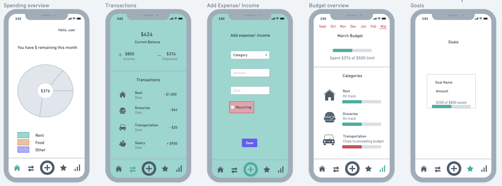
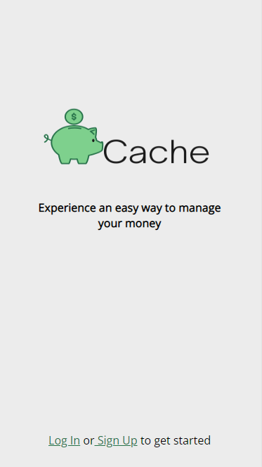
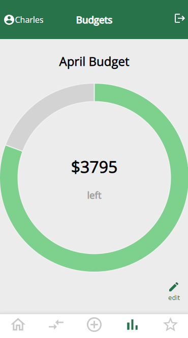
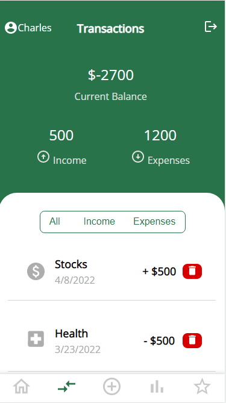
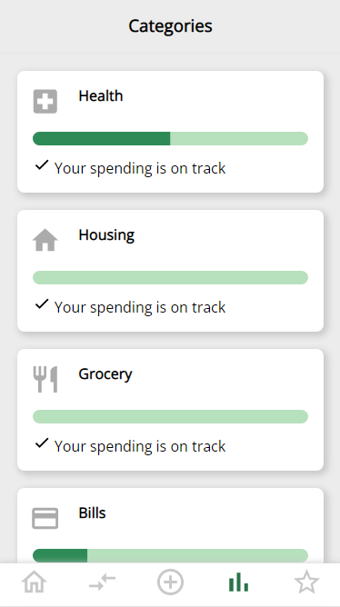
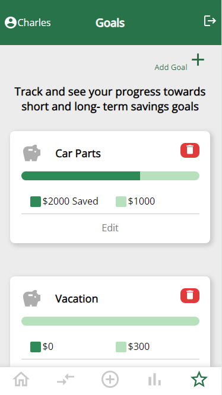

# Cache  

Cache is a budgeting app where users can manage their expenses, income and saving goals all in one place. It can be difficult to keep track of where your money is going, especially with the rise of online shopping and other digital transactions. Cache simplifies tracking your spending habits with specified budgets displayed visually each month.  

# Getting Started

Click [here](https://cachefrontend.herokuapp.com/) to view the app. 

### Project Planning Materials  
[ERD](https://whimsical.com/cache-budget-app-erd-Vxzr1JRk8dCMnrtuzNmMjN">)

[Trello](https://trello.com/b/VL89qktx/cache-budget-app)

# Wireframe
  
 

# Cache Screenshots

<table>
  <tr>
    <td></td>
    <td></td>
    <td></td>
    <td></td>
    <td></td>
    <td></td>
  </tr>
 </table>

# Technologies Used

  

  

  

  

  

  

  

  

  

  
  
  

# Next Steps

- [ ] Users can view summaries of their previous monthly budgets.
- [ ] Users can create recurring incomes and expenses which are automatically added according to the specified time period.
- [ ] Import previous budget data into next months budget.
- [ ] Sorting transactions by date - most recent at the top.
- [ ] Implement Light/Dark mode.
- [ ] Implement a bank account api
